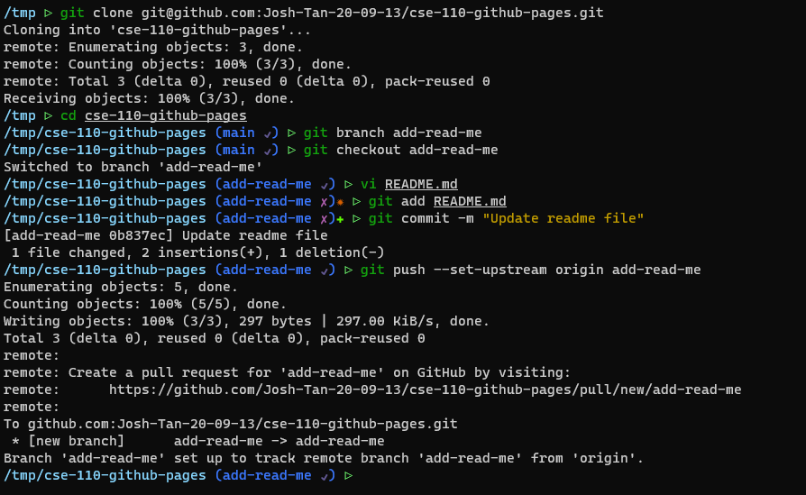
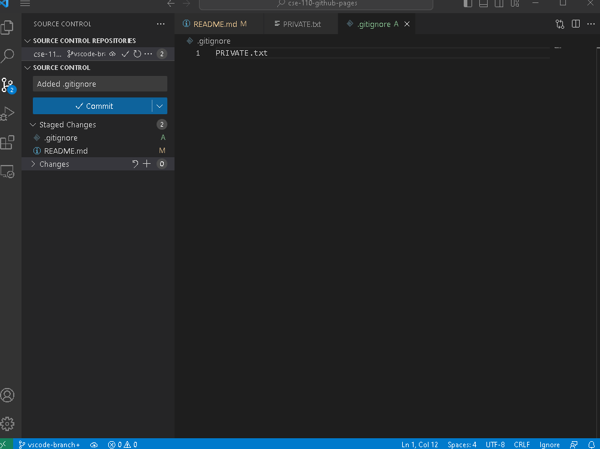

# User Page 
# Text Stylization
Hi everybody, I am Joshua Tan and this is my user page for the class **CSE 110** at the University of California, San Diego.  
One of my favorite computer science related books is *The C Programming Language* by Brian Kernighan and Dennis Ritchie.  
I like to work on anything technology related and have recently taken a deep dive into computer hardware and overclocking.  
I enjoy good food, socializing, video games, and sleeping.  
~~I can't think of anything else to write~~  
***Anyway, that is all for this section***
## Images
Here is the screenshot of the git command line:  

Here is the screenshot of the vscode git:  

## Quotes
> This is a very profound quote, yes indeed  

You can use the `print()` function to print something  
For example `printf("Hello, World\n")`  
Anyway, here is a code block:  
```
#include <stdio.h>

int main(int argc, char *argv[]) {
    return 0;
}
```
> Here is a mix of both: `code`

## Links
Here are some external links:  
[This is a very cool link](https://setwithfriends.com)  
[Here is another very cool link](https://youtube.com)  
Here are some section links:  
[Back to Top](#top)  
[Back to Images](#images)  
Here are some relative links:  
[git cmd image](screenshots/cmdgit.png)  
[git vscode image](screenshots/vscodegit.png)  
[link page](pages/bait.md)
## Ordered and Unordered List
Unordered List:  
- Get more knowledge
- Secure records
- Enjoy time
Ordered List:
1. Wake up
2. Exist
3. Sleep
## Task list
- [x] Wake up
- [ ] Exist
- [ ] Sleep
